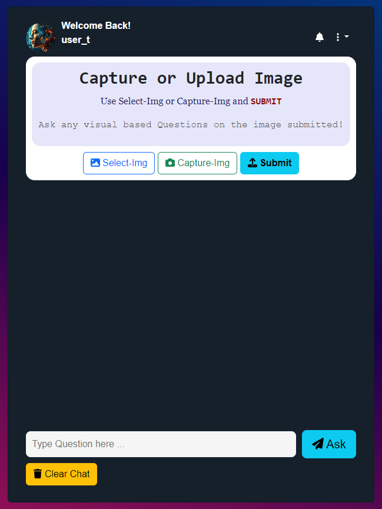
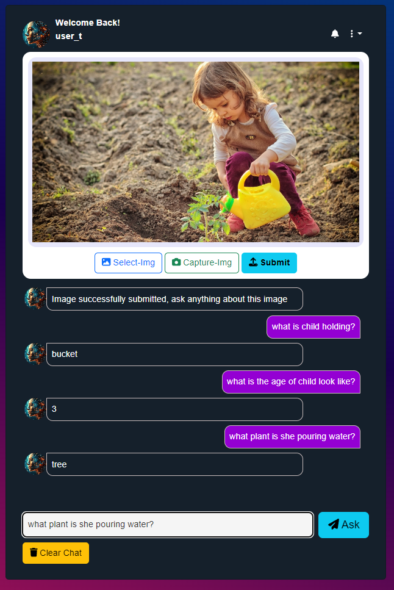
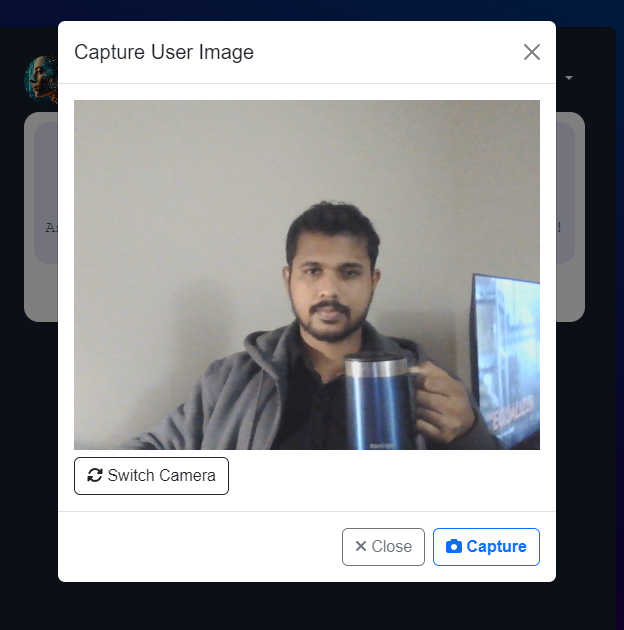
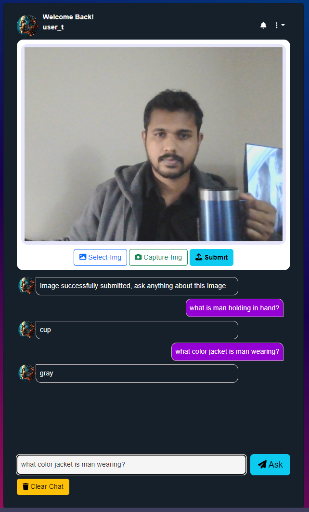
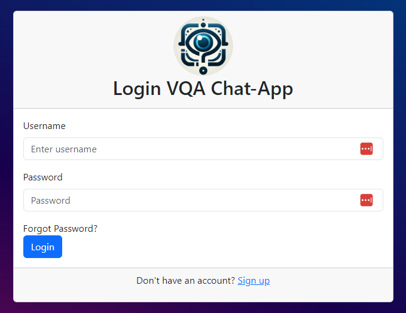
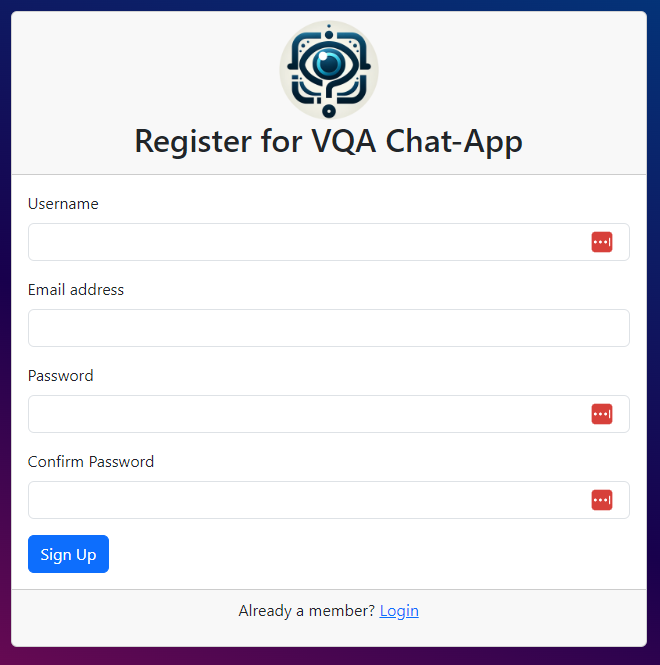

# Visual Question Answering Chat-App(VQA)

## Summary

* **Projet Goal:** AI based Web-Application for Visual Question Answering.
* **Inputs for the System:** Image captured by the Camera of phone or Web-cam the Laptop, Question to ask from the Image
* **output of the System:** An Initial statement about the input picture, Answer for the user question based on Visual contents of image.

## User Interface

* Web-Application in a Chat and Reply type UI.
* Users can Sign-up and login into the web-app.
* Front End UI allows the user to capture a photo using the camera or Upload a picture from device.
* Provide an initial Statement/prompt about the picture to the user.
* Request for any Visual content based Question from the User about the Image.
* User type in a question about the image's visual content. 
* System Responds with an Answer generated by the VQA framework and displayed as chat reply.

# Repo for Python Flask VQA Web-Application
* Web App Dir: [Link to Web-app](./WebApp)

# Front End Screen-Shots

## VQA Chat App Home Page

## Question and Answers for a Image Uploaded from Device

## Capture a Image and Ask Questions from It
#### Currently Supported only for Laptop/PC Web-Cams

## User Login and Register Pages

